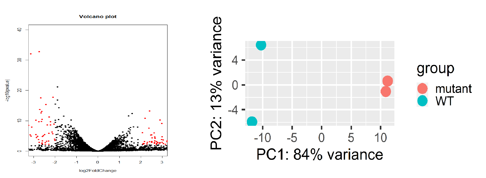
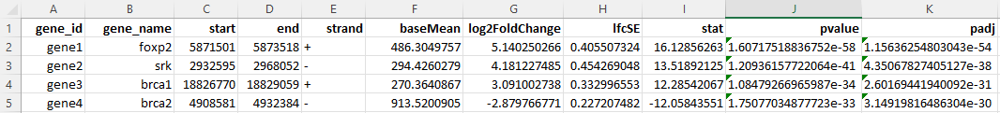

# RNA-Seq Pipeline
<i>An RNA-Seq pipeline for eukaryotic systems written in Python</i> 
C. Breuer, 2024

# Overview:
This pipeline is designed for the analysis of RNA-Seq data from eukaryotic systems. The offers quality assessment with FastQC, and calls pipeline RNA STAR, an efficient splicing-aware aligner via the linux (or WSL) command line. Additional scripts are provided for running differential expression analysis with DESeq2 in R, and for annotating those results with gene names using a GTF file. 

# Outputs Include
## Volcano plots and PCA analyses

## Differential Gene Expression Tables

# Prerequisites
1) Linux or WSL. It is expected that this pipeline will be executed in a linux environment.
2) Python3 and Java (for FastQC)
- apt-install python3
3) The RNA-STAR aligner should be installed. This can be done using the following commands in Ubuntu:
- apt-get update
- apt-install RNA-STAR
- For more information, see the  [STAR manual].(https://physiology.med.cornell.edu/faculty/skrabanek/lab/angsd/lecture_notes/STARmanual.pdf).
4) An RNA-STAR reference genome (see the STAR manual for commands). This requires you to have a fasta formatted genome file and (optionally) an annotations file (e.g. a .gtf file). <b>It is highly beneficial to include the GTF annotation file as this will allow STAR to tally read counts while doing the alignmenment.</b> Place the output STAR genome files in a folder named "genomefiles".
5) For rDNA quality control mapping, an rRNA (or tRNA, etc.) fasta sequence and Bowtie2 are required. Bowtie2 can be installed with:
- apt-get update
- apt-install bowtie2
- Follow the instructions for installing a bowtie genome. e.g. bowtie2-build <path/to/genome.fa> <genomeName>. Move the output genome files to the "genomefiles" folder.

# Setup
1) Create a working folder for your analysis
2) Within the working folder, you should have your fastq files in a folder called "fastq". Fastq file name should be formatted like "sample1_R1.fastq" and "sample1_R2.fastq" for a typical paired-end sample. Files can also be gzipped and named like "Sample1_R1.fq.gz" or "Sample1_R1.fastq.gz". If additional formats are required, please edit the rnaSeq.py script, or change the filenames with the provided change_filenames.py script (no arguments needed).
3) Ensure that STAR can be called in the linux/WSL command line using command "RNA-STAR".
4) All STAR and Bowtie2 genome files should be placed in a subdirectory called "genomefiles". For example, for STAR genome named "dm6", the files should be under yourworkingdirectory/genomefiles/dm6. For bowtie2 genome "bs168", the files should be under yourworkingdirectory/genomefiles. Note that these filepaths can be changed if you edit the rnaSeq.py script customization section.
5) Fasta formatted genome files and genome annotation files (e.g. .gtf) should be in ./genomefiles. 
6) Edit the User Customization section of the rnaSeq.py script in any text editor. Specifically, change line 265 as needed to indicate the name of the genome you're mapping to. i.e. if you named the STAR genome "dm6" for Drosophila melanogaster build number 6, then that line should read g='dm6'.

# File Prep (optional)
1) Fastq files can be trimmed on adapters if desired. To do this, start a WSL terminal in the working directory and enter python ./scripts/runTrimmomatic.py. Follow the prompts to trim universal TruSeq adaptors from your reads. The script can be edited for other primer sequences.
2) For quickly test for rRNA (or other) undesirable contaminants, the a small sample of each fastq file can be created. To do this, start a WSL terminal in the working directory and enter python./scripts/shrinkFastq.py. Follow the on-screen prompts to select the desired numbmer of reads in the small fastq outfiles (e.g. 250000 is often enough). See QC steps below for instructions on running the rRNA mapping.

# Running the pipeline
1) The pipeline can be run by executing the rnaSeq.py script with the command: python rnaSeq.py. 
- The script will provide run options as screen prompts.
- You may want to first run the script with only the FastQC option. At that point, you can examine your sequence quality and, if needed, trim the ends with Trimmomatic (wrapper and executable are provided in the scripts folder). 
2) Follow the prompts to activate FastQC, alignment by STAR, and to use FeatureCounts. 
3) Notes:
- Default STAR settings will result in STAR producing read counts as part of the alignment process. This will only occur if you input a gene annotation file when building your STAR genome.
- STAR will output aligned files in .bam format. 

# Running QC:
1) To test for contaminating rRNA/tRNA/etc. follow the instructions above (File Prep) to sample the fastq files (or you can map the whole file, it will just take longer). Open a WSL terminal in the working directory and enter python ./scripts/map2rDNA.py to do the alignment. Alignment statistics will be output to a log file in the working directory. Note that you will have to have previously set up genome files for this mapping to work.

# Differential Expression Analysis with DESeq2
1) Follow the instructions in the DESeq manual to set up readcounts input files and metadata. The data (readcounts) file looks like this:

gene	        Sample1	    Sample2	    Sample3     Sample4     Sample5     Sample6
gene1       	2257	    2440	    2537	    611         501         413
gene2       	0	        1	        0	        1           7           2
gene3       	1217	    1394	    1239	    801         413         578         
gene4       	0	        0	        0	        0           0           0
gene5       	20	        19	        7	        12          15          4

Here the samples 1-3 are controls and samples 3-6 are test. As such the metadata file looks like this:
id	            genotype
Sample1      	WT
Sample2 	    WT
Sample3 	    WT
Sample4 	    Mutant
Sample5         Mutant
Sample6         Mutant

- To analyze these files, load them into R using the DESeq2.R script in RStudio.
- This will output a volcano plot with significantly changed genes highlighted in red, and a 2D principal component analysis plot to visually display sample variability.
- To label the DESEq outfiles with gene level information, open the annotateRC.R script in R studio. Load your GTF file and follow the steps to merge the two tables.

# Downstream Analysis
- Though not covered here, differential gene expression profiles can be loaded into pathway analysis software (e.g. Ingenuity Pathway Analysis) to get a sense of the broader significance of your gene signatures.
